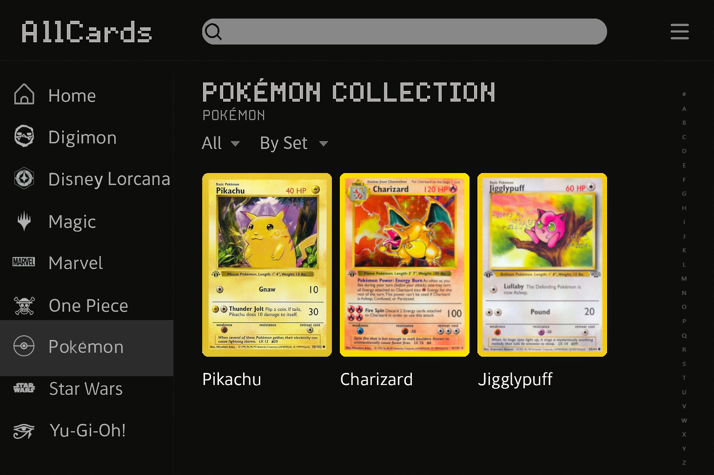

# AllCards

AllCards is a web application that brings trading card collecting into the digital era. It lets users create a searchable, personal digital binder where they can store, browse, and organize cards from various franchises such as Pokémon, Yu-Gi-Oh, Magic: The Gathering, and more.

---

## Project Vision

To create the most intuitive and personalized digital binder experience for collectors and fans of trading card games — a place to truly own, explore, and organize their card collections the way they want.

#### Trading Card Franchises

###### The Big Three:

-   `Magic: The Gathering`
-   `Pokémon Trading Card Game`
-   `Yu-Gi-Oh! Trading Card Game`

###### The Newcomers:

-   `Digimon Trading Card Game`
-   `Disney Lorcana`
-   `Marvel Champions: The Card Game`
-   `One Piece Trading Card Game`
-   `Star Wars Unlimited`

---

## The Problem

-   Physical binders are limited and not easily shareable
-   Online databases often lack personalization
-   Users often spread their collections across multiple platforms
-   No tool combines visual collection browsing with tagging, searching, and favorites

AllCards solves this by offering a central, personalized, visually rich digital binder that works across all franchises.

---

## Target Audience

-   Casual and hardcore TCG collectors
-   Competitive players building and managing decks
-   Newcomers to trading card games
-   Collectors of specific or multiple franchises

Whether you collect Pokémon, One Piece, Yu-Gi-Oh, or Magic, AllCards gives you one place to manage it all.

---

## Tech Stack

| Layer     | Technology                           |
| --------- | ------------------------------------ |
| Frontend  | React, TailwindCSS                   |
| Backend   | Firebase (Authentication, Firestore) |
| APIs      | Pokémon TCG API (more to come)       |
| Languages | HTML, CSS, JavaScript                |

This stack allows fast development, real-time updates, and a responsive user interface.

---

## MVP Features

-   Upload card images with name, set, and metadata
-   View cards by collection/set or as part of a custom-built deck
-   Organize using tags, trademarks, and folders
-   Simple login system for storing user-specific data

---

## Stretch Goals

-   Advanced filtering by rarity, franchise, and custom tags
-   Social features like public collections and sharing
-   Showcase Mode (e.g., a slideshow view)
-   API integrations for auto-tagging and verification

---

## 📆 Development Timeline (9 Weeks)

| Week | Focus                                  |
| ---- | -------------------------------------- |
| 1    | Project Setup & Planning               |
| 2    | UI Mockups & Firebase Initialization   |
| 3    | Authentication & Card Upload           |
| 4    | Collection Viewing Features            |
| 5    | Tagging, Sorting, Deletion             |
| 6    | MVP Polishing & Bug Fixing             |
| 7    | Advanced Search & Filtering            |
| 8    | Showcase Mode & Sharing Options        |
| 9    | Final Polish, Presentation, Deployment |

---

## 📂 Project Structure (Planned)

```bash
ALLCARDS/                                   # root directory of AllCards
├── node_modules/
├── presentation/                           # Presentation slide deck and script
│   ├── Initial/                            # The initial pitch design and early mockups
│   │   ├── AllCards Pitch Script.pdf
│   │   └── AllCards Pitch Slides.pdf
│   │
│   ├── Mid/                                # The mid-project checkpoint progression
│   │   └── TBD
│   │
│   ├── Final/                              # The final presentation slides, scripts, and visuals
│   │   └── TBD
│   │
│   └── README.md
│
├── public/                                 # Publicly served assets (no bundling)
│   ├── index.html                          # Root HTML entry point for the app
│   └── vite.svg
│
├── src/                                    # Application source code
│   ├── App.css                             # Styles for App.tsx container and layout
│   ├── App.tsx                             # Root-level component that assembles UI
│   ├── main.tsx                            # App entry point rendering App.tsx
│   ├── vite-env.d.ts
│   └── assets/                             # Static assets used in the UI
│       ├── components/                     # Reusable UI components
│       │   ├── NavBar.tsx                  # Top navigation bar component
│       │   └── TBD
│       │
│       ├── css/                            # Stylesheets for component styling
│       │   ├── global.css                  # Global styles (e.g., font, body color)
│       │   └── NavBar.css                  # Navigation bar styling
│       │
│       ├── images/                         # Visual assets (logos, favicons, mockups)
│       │   ├── icons/                      # .ico-format icons for franchise branding
│       │   │   ├── digimon.ico
│       │   │   ├── disney-lorcana.ico
│       │   │   ├── magic.ico
│       │   │   ├── marvel.ico
│       │   │   ├── one-piece.ico
│       │   │   ├── pokemon.ico
│       │   │   ├── star-wars.ico
│       │   │   └── yu-gi-oh.ico
│       │   ├── logos/                      # Full-color and minimalist logo PNGs
│       │   │   ├── example-logo.png
│       │   │   ├── logo-with-name.png
│       │   │   ├── logo.png
│       │   │   └── nerd-group.png
│       │   │
│       │   ├── tcg-cards/                  # Full-color and minimalist logo PNGs
│       │   │   ├── big-three.png
│       │   │   ├── magic-the-gathering-cards.png
│       │   │   ├── magic-the-gathering-game.png
│       │   │   ├── one-piece-cards.png
│       │   │   ├── pokemon-cards-2.png
│       │   │   ├── pokemon-cards.png
│       │   │   └── yu-gi-oh-cards.png
│       │   │
│       │   ├── tcg-logos/                  # Full-color and minimalist logo PNGs
│       │   │   ├── digimon-color-logo.png
│       │   │   ├── digimon-logo.png
│       │   │   ├── disney-lorcana-color-logo.png
│       │   │   ├── disney-lorcana-logo.png
│       │   │   ├── magic-color-logo.png
│       │   │   ├── magic-logo.png
│       │   │   ├── marvel-color-logo.png
│       │   │   ├── marvel-logo.png
│       │   │   ├── one-piece-color-logo.png
│       │   │   ├── one-piece-logo.png
│       │   │   ├── pokemon-color-logo.png
│       │   │   ├── pokemon-logo.png
│       │   │   ├── star-wars-color-logo.png
│       │   │   ├── star-wars-logo.png
│       │   │   ├── yu-gi-oh-color-logo.png
│       │   │   └── yu-gi-oh-logo.png
│       │   │
│       │   ├── Example-AllCards.png
│       │   └── README.md
│       │
│       ├── pages/                          # React pages/views
│       │   └── TBD
│       │
│       └── Example-AllCards.png
│
├── .gitignore
├── .prettierrc
├── eslint.config.js
├── package-lock.json
├── package.json
├── PRETTIER_CONFIG.md
├── README.md
├── tsconfig.app.json
├── tsconfig.json
├── tsconfig.node.json
└── vite.config.ts

```

---

## UI Preview

Here is a mockup of what the AllCards interface might look like. Users will be able to visually browse their collection, organized by franchises like Pokémon, Magic, and Yu-Gi-Oh:



_Note: This is a mock UI preview. The final interface is currently in development and will be shared soon._

---

## 👥 Team Members

-   Anisur Rahman
-   Blaise Pierre
-   Richard Vilcinsh
-   Ryan O'Connor

---

## 📄 License

This project is for academic purposes (Capstone CSCI 499). Licensing and permissions will be considered for public release after project completion.

---

## Contributions

Currently limited to team members. Forks and pull requests may be opened after initial release.

---
