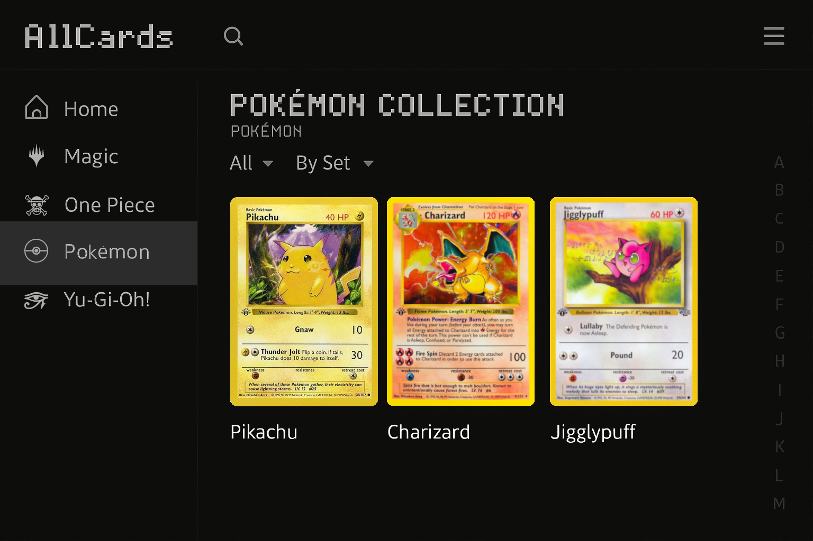

# AllCards

AllCards is a web application that brings trading card collecting into the digital era. It lets users create a searchable, personal digital binder where they can store, browse, and organize cards from various franchises such as Pokémon, Yu-Gi-Oh, Magic: The Gathering, and more.

---

## Project Vision

To create the most intuitive and personalized digital binder experience for collectors and fans of trading card games — a place to truly own, explore, and organize their card collections the way they want.

---

## The Problem

- Physical binders are limited and not easily shareable
- Online databases often lack personalization
- Users often spread their collections across multiple platforms
- No tool combines visual collection browsing with tagging, searching, and favorites

AllCards solves this by offering a central, personalized, visually rich digital binder that works across all franchises.

---

## Target Audience

- Casual and hardcore TCG collectors
- Competitive players building and managing decks
- Newcomers to trading card games
- Collectors of specific or multiple franchises

Whether you collect Pokémon, One Piece, Yu-Gi-Oh, or Magic, AllCards gives you one place to manage it all.

---

## Tech Stack

| Layer         | Technology                  |
|---------------|------------------------------|
| Frontend      | React, TailwindCSS           |
| Backend       | Firebase (Authentication, Firestore) |
| APIs          | Pokémon TCG API (more to come) |
| Languages     | HTML, CSS, JavaScript        |

This stack allows fast development, real-time updates, and a responsive user interface.

---

## MVP Features

- Upload card images with name, set, and metadata
- View cards by collection/set or as part of a custom-built deck
- Organize using tags, trademarks, and folders
- Simple login system for storing user-specific data

---

## Stretch Goals

- Advanced filtering by rarity, franchise, and custom tags
- Social features like public collections and sharing
- Showcase Mode (e.g., a slideshow view)
- API integrations for auto-tagging and verification

---

## 📆 Development Timeline (9 Weeks)

| Week | Focus                                      |
|------|--------------------------------------------|
| 1    | Project Setup & Planning                   |
| 2    | UI Mockups & Firebase Initialization       |
| 3    | Authentication & Card Upload               |
| 4    | Collection Viewing Features                |
| 5    | Tagging, Sorting, Deletion                 |
| 6    | MVP Polishing & Bug Fixing                 |
| 7    | Advanced Search & Filtering                |
| 8    | Showcase Mode & Sharing Options            |
| 9    | Final Polish, Presentation, Deployment     |

---


## Project Structure

#### Planned (subject to change)

```bash
src/
├── components/        # Reusable UI components (Card, Deck, Layout, etc.)
│   ├── Card/          # Card-related components (display, upload, modal)
│   ├── Collection/    # Collection browsing and filtering UIs
│   ├── Deck/          # Deck builder and viewer components
│   ├── Auth/          # Login, Register, Logout components
│   ├── Layout/        # Shared layout elements (Navbar, Sidebar)
│   └── Shared/        # Misc shared components (Buttons, Tags, Modals)
├── pages/             # Top-level route views rendered by React Router
│   ├── Home.jsx       # Landing page for non-authenticated users
│   ├── Login.jsx      # Login page
│   ├── Register.jsx   # Registration page
│   ├── Dashboard.jsx  # Main user dashboard with binder view
│   └── NotFound.jsx   # 404 page for invalid routes
├── context/           # React Context providers (Auth, Cards)
├── hooks/             # Custom React hooks
├── services/          # Firebase and external API integration
├── utils/             # Utility functions (e.g., metadata parsing)
├── App.jsx            # Main application shell and router container
└── main.jsx           # Entry point that renders <App /> to the DOM
```"""

---

## UI Preview

Here is a mockup of what the AllCards interface might look like. Users will be able to visually browse their collection, organized by franchises like Pokémon, Magic, and Yu-Gi-Oh:



_Note: This is a mock UI preview. The final interface is currently in development and will be shared soon._

---

## 👥 Team Members

- Anisur Rahman  
- Blaise Pierre  
- Richard Vilcinsh  
- Ryan O'Connor  

---

## 📄 License

This project is for academic purposes (Capstone CSCI 499). Licensing and permissions will be considered for public release after project completion.

---

## Contributions

Currently limited to team members. Forks and pull requests may be opened after initial release.

---