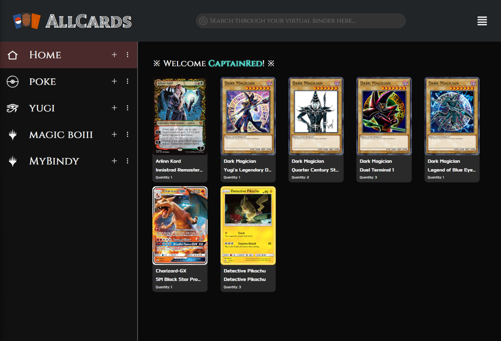

# AllCards

AllCards is a web application designed to modernize the trading card collecting experience. It provides users with a searchable, customizable digital binder where they can store, browse, and organize cards from multiple franchises. Supported games include Pokémon, Yu-Gi-Oh!, Magic: The Gathering, and more, all presented in one visually unified platform.

---

## Project Vision

To build the most intuitive, flexible, and franchise-spanning digital binder for trading card collectors. This is a space where users can truly own, explore, and manage their collections with powerful tools and a personalized experience at the core.

---

## Supported Franchises

### The Big Three

- Magic: The Gathering
- Pokémon Trading Card Game
- Yu-Gi-Oh! Trading Card Game

### The Newcomers

- Digimon Trading Card Game
- Disney Lorcana
- Marvel Champions: The Card Game
- One Piece Trading Card Game
- Star Wars Unlimited

---

## The Problem

- Physical binders are limited and not easily shareable
- Online databases often lack personalization
- Users often spread their collections across multiple platforms
- No existing tool combines visual collection browsing with tagging, searching, and franchise flexibility

**AllCards** solves this by offering a central, personalized, visually rich digital binder that supports multiple franchises with consistent UX and powerful features.

---

## Target Audience

- Casual and hardcore TCG collectors
- Competitive players building and managing decks
- Newcomers to trading card games
- Fans of specific or multiple franchises

Whether you collect Pokémon, One Piece, Yu-Gi-Oh, or Magic, AllCards gives you one place to manage it all.

---

## Tech Stack

| Layer    | Technology                           |
| -------- | ------------------------------------ |
| Frontend | React (TypeScript), Bootstrap CSS    |
| Backend  | Firebase (Authentication, Firestore) |
| APIs     | Custom integrations per franchise    |
| Language | HTML, CSS, JavaScript / TypeScript   |

---

## APIs

| Franchise           | API Endpoint                               |
| ------------------- | ------------------------------------------ |
| Magic the Gathering | https://scryfall.com/docs/api/cards/search |
| Pokémon             | https://docs.pokemontcg.io/                |
| Yu-Gi-Oh!           | https://ygoprodeck.com/api-guide/          |

more to come...

---

## MVP Features

- Add cards by searching via API (name, set, etc.)
- Store metadata like name, image, set, rarity, and franchise
- Display card images in visually uniform layouts
- Organize by franchise tab with custom names
- View collections and recently added or viewed cards
- Firebase authentication and per-user storage in Firestore

---

## Stretch Goals

- Advanced filtering by rarity, franchise, and custom tags
- Slideshow/Showcase Mode for binder viewing
- Public profile mode for sharing collections
- Auto-tagging via API metadata and card features
- Add support for double-faced and alternate layout cards

---

## Development Timeline

| Week | Focus                                    |
| ---- | ---------------------------------------- |
| 1    | Project Setup & Planning                 |
| 2    | UI Mockups & Firebase Initialization     |
| 3    | Authentication & Add Card Popup          |
| 4    | Franchise Tabs & Firestore Integration   |
| 5    | Tagging, Sorting, Deletion Features      |
| 6    | MVP Polishing & Bug Fixes                |
| 7    | Advanced Filtering & Search Improvements |
| 8    | Sharing & Showcase Mode                  |
| 9    | Final Polish, Presentation, Deployment   |

---

## Project Structure (Planned)

```bash

All_Cards/           # Vite + React project root
├── public/          # Public assets
├── src/             # App source code
│   ├── assets/
│   │   ├── apis/    # Franchise-specific API integration utilities
│   │   ├── css/     # CSS files per component or page
│   │   ├── images/  # Placeholder and UI images
│   │   ├── types/   # TypeScript type definitions and interfaces
│   ├── components/  # Reusable components (NavBar, Sidebar, etc.)
│   ├── firebase/    # Firebase setup and utilities
│   ├── pages/       # Top-level view/page components rendered by routes
│   ├── App.tsx      # Main app wrapper
│   └── main.tsx     # Entry point
├── README.md
└── ...

```

---

## UI Preview

The mockup of what the AllCards interface might look like:


A preview of the digital binder interface:



_Note: Final interface in active development._

---

## 👥 Team Members

- Anisur Rahman
- Blaise Pierre
- Richard Vilcinsh
- Ryan O'Connor

---

## 📄 License

This project is for academic purposes as part of Capstone CSCI 499. No public or commercial use is permitted at this stage.

---

## Contributions

Currently restricted to internal development. Public contributions may be opened post-release.

---
